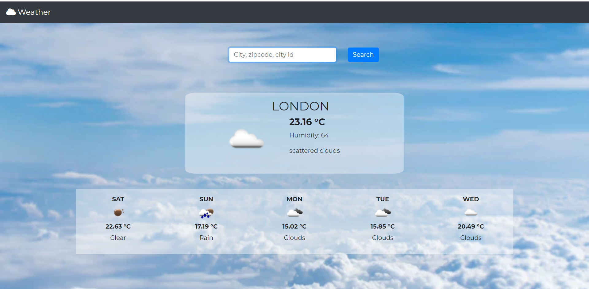

# Weather-App

This web app is developed using Node.js as primary language and uses [Open weather](https://openweathermap.org/api) API to get weather data. Visit weather app at [https://weathercloudapp.herokuapp.com/](https://weathercloudapp.herokuapp.com/)

Using this app, current weather can be found out based on 
1. city name
2. city id
3. zipcode

In addition to displaying current weather, this app all display the weather forcast for next **5 days**.
## Getting Started

### Prerequisites

Get [Open weather website](https://openweathermap.org/api) and get an API KEY to query the API for weather data.

This project makes two API calls 
1. [Current Weather](api.openweathermap.org/data/2.5/weather?q=London) - To fetch current weather
2. [5 days/ 3 hours](api.openweathermap.org/data/2.5/forecast?q=London,us&mode=xml) - To fetch weather forcast for next 5 days.

